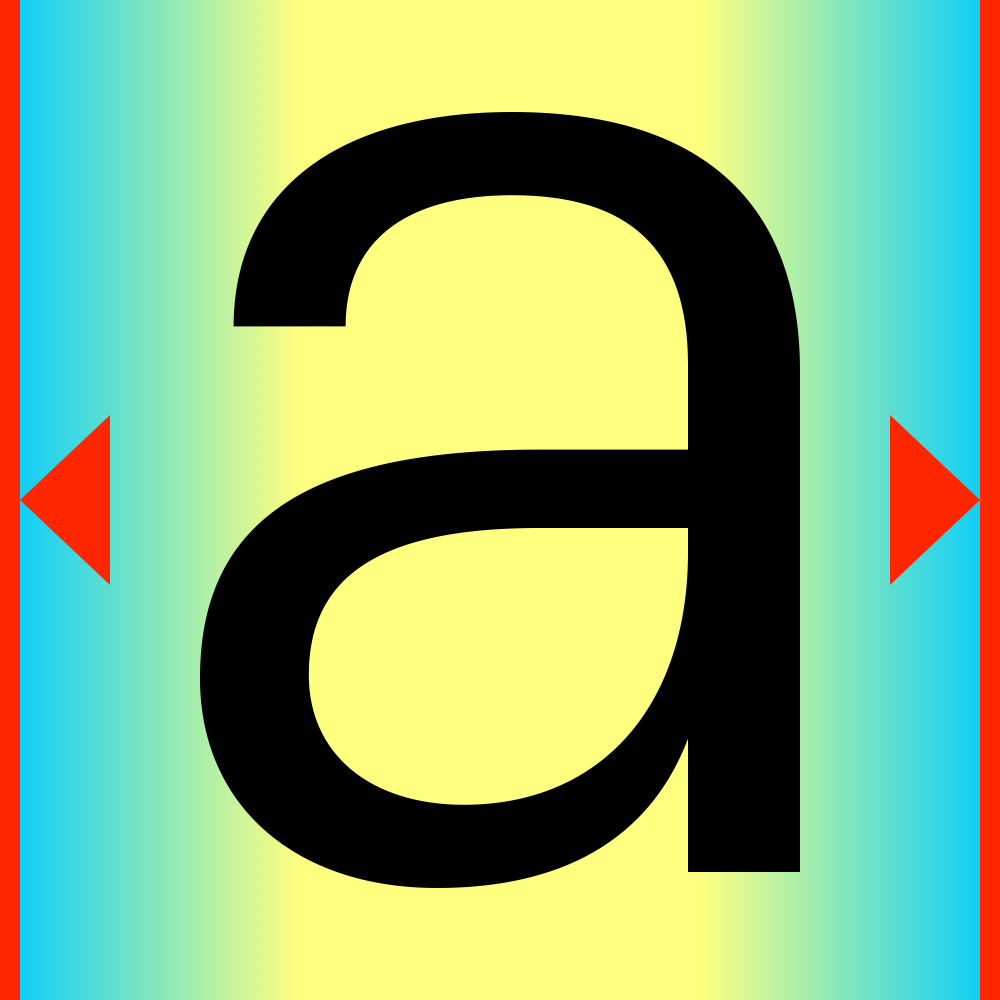

Variable Spacing
================

*adding a spacing axis to variable fonts*

Background
----------

- [Spacing Axis Proposal by Frank Blokland](http://github.com/Microsoft/OpenTypeDesignVariationAxisTags/blob/master/Proposals/Spacing_Axis/ProposalSummary.md)
- [discussion of the proposal](https://github.com/Microsoft/OpenTypeDesignVariationAxisTags/issues/11)
- [discussion on TypeDrawers](https://typedrawers.com/discussion/2088/otvar-spacing-axis)
- [HEX Franklin](#)

In this repository
------------------

- the Spacing States data format
- workflow and code to produce variable fonts containing a spacing axis
- RoboFont extension with interface and preview
- demo fonts and their build scripts
- DrawBot tools to visualize and compare spacing designspaces

see the [documentation](http://hipertipo.gitlab.io/VariableSpacing/) for more info 
